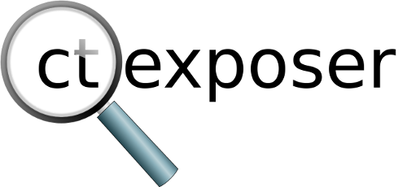

# Discover sub-domains by searching through Certificate Transparency logs

## What is CT?
Certificate Transparency (CT) is an experimental IETF standard. The goal of it was to allow the public to audit which certificates were created by Certificate Authorities (CA). TLS has a weakness that comes from the large list of CAs that your browser implicitly trusts. If any of those CAs were to maliciously create a new certificate for a domain, your browser would trust it. CT adds benefits to TLS certificate trust: Companies can monitor who is creating certificates for the domains they own. It also allows browsers to verify that the certificate for a given domain is in the public log record.

These logs end up being a gold mine of information for penetration testers and red teams.

## What can you find with ct-exposer?
ct-exposer will query the CT logs for a given domain, and then try to do DNS look ups for the domains to see which ones exist in DNS. In my experience, so far, I've found numerous sub-domains that were not located with 'site:domain.com' google searches. Keep in mind that the domains that do not resolve, they can either be old domains, or internal only domains (Ex: you need access to the internal DNS server to resolve them). 

## Requirements
Python, gevent, requests, and urllib3.

## Example output

```shell
python3 ct-exposer.py teslamotors.com
[+]: Downloading domain list...
[+]: Download of domain list complete.
[+]: Parsed 76 domain(s) from list.

[+]: Domains found:
209.133.79.61 shop.teslamotors.com
23.227.38.64  shop.eu.teslamotors.com
104.70.206.244  akamaisecure.qualtrics.com
209.10.208.55 sdlcvpn.teslamotors.com
209.11.133.50 extconfl.teslamotors.com
209.10.208.24 energystorage.teslamotors.com
104.100.84.43 www.teslamotors.com
211.147.88.104  cnvpn.teslamotors.com
149.14.82.93  euvpn.teslamotors.com
209.11.133.106  teslamotors.com
205.234.27.226  sftp.teslamotors.com
104.100.62.208  resources.teslamotors.com
209.133.79.54 www-origin.teslamotors.com
211.147.80.202  cn.auth.teslamotors.com
209.11.133.110  epc.teslamotors.com
32.58.244.107 eumobility.teslamotors.com
209.11.133.37 service.teslamotors.com
211.147.80.203  xmailcn.teslamotors.com
209.10.208.31 fleetview.teslamotors.com
209.11.133.11 lync.teslamotors.com
209.133.79.61 tesla.com
205.234.31.120  owner-api.teslamotors.com
14.136.104.118  hkvpn.teslamotors.com
209.11.133.107  toolbox.teslamotors.com
211.147.80.201  mycn-origin.teslamotors.com
205.234.27.212  wsproxy.teslamotors.com
209.11.133.61 xmail.teslamotors.com
205.234.27.250  upload.teslamotors.com
205.234.31.121  streaming.vn.teslamotors.com
209.133.79.59 suppliers.teslamotors.com
205.234.31.123  fleet-api.teslamotors.com
209.10.208.20 trt.teslamotors.com
64.125.183.134  leaseappde.teslamotors.com
23.227.38.64  shop.uk.teslamotors.com
12.201.132.70 plcvpn.teslamotors.com
209.11.133.36 supercharger.teslamotors.com
205.234.27.218  vpn.teslamotors.com
205.234.27.243  adfs.teslamotors.com
205.234.27.200  teslaplm-external.teslamotors.com
209.10.208.27 us.auth.teslamotors.com
205.234.27.211  origin-www45.teslamotors.com
205.234.27.197  smswsproxy.teslamotors.com
64.125.183.134  leaseapp.teslamotors.com
205.234.27.246  quickbase.teslamotors.com
209.11.133.35 extissues.teslamotors.com
211.147.80.205  wechat.teslamotors.com

[+]: Domains with no DNS record:
none  creditauction.teslamotors.com
none  tel.vn.teslamotors.com
none  lockit.teslamotors.com
none  tesla3dx.teslamotors.com
none  referral.teslamotors.com
none  neovi-vpn.teslamotors.com
none  shop.ca.teslamotors.com
none  resources.tesla.com
none  lockpay.teslamotors.com
none  shop.dk.teslamotors.com
none  origin-wte.teslamotors.com
none  shop.se.teslamotors.com
none  sling.teslamotors.com
none  leadgen.teslamotors.com
none  sip.teslamotors.com
none  evprd.teslamotors.com
none  imail.teslamotors.com
none  pvg01-cpi-cppm.teslamotors.com
none  www45.teslamotors.com
none  sjc04p2staap04.teslamotors.com
none  testimail.teslamotors.com
none  shop.ch.teslamotors.com
none  toolbox-energy.teslamotors.com
none  securemail.teslamotors.com
none  www-uat2.teslamotors.com
none  jupytersvn.teslamotors.com
none  wd.s3.teslamotors.com
none  shop.no.teslamotors.com
none  cdn02.c3edge.net
none  vpn-node0.teslamotors.com
```
